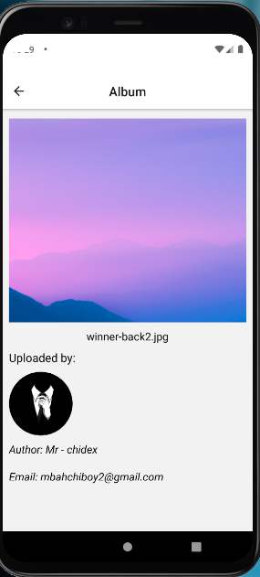

# Album

Photo App with React Native - Practice

# Demo

- [View Demo](https://drive.google.com/file/d/14tXiJVJR71VcsNQgmNg8GhysqoANHwnt/view?usp=sharing)

## Clone this project

    $ git clone https://github.com/mr-chidex/Album.git
    $ cd Album

# Preview

  
  
  
## Configure app

- Create a file named `.env` in the project root directory
- Add the environment variables as described in `local.env` file

## Install dependencies

    $ yarn install

### Running this project locally

    $ yarn start

## Show your support

Give a ⭐️ if you like this project!

## Copyright

Copyright (c) mr-chidex
